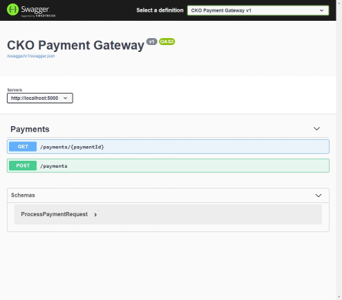
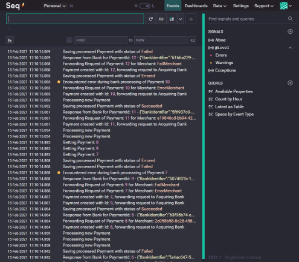

# Payment Gateway

## Required

- docker
- docker-compose

## Running

Start the containers with:

```bash
docker-compose up -d --build
```

Give it a moment to build and spin up. Unit tests are run as part of the build.

Once ready, you can browse to the following:

- Swagger UI: http://localhost:5000/swagger
- Seq: http://localhost:5342/

You can interact with the Payment Gateway using the Swagger UI and view the logs in Seq.





## Sandbox Tests

There is also a Dockerfile to run sandbox tests. The following command will execute them:

```bash
docker run --rm $(docker build -q -f ./tests/sandbox/Dockerfile .)
```

(should work in both PowerShell and bash)

## Cleaning Up

```bash
docker-compose down
```

# Developer Notes

## Built on/with:

- Windows 10
- Linux (via WSL2)
- JetBrains Rider
- .NET Core SDK 3.1.405
- PowerShell/bash

## Code Structure

Main code lives in the `src` directory. Tests can be found in  `tests`.

### PG.Core

Contains all core logic and types. Interfaces to external dependencies (Bank, data storage) are defined here.

### PG.Adapters

Implementations of external dependencies.

[MartenDB](https://martendb.io) was picked for data storage as it's quick to get up and running.

For the Bank, I created a `FakeBankClient` to simulate an Acquiring bank. The adapter can return different results based on the merchantId being passed in. [View the code for more details](./src/PG.Adapters/AcquiringBank/FakeBankClient.cs). This will be easy to swap out in the future.

### PG.WebApi

Connects the Adapters up with the Core and hosts it as a WebApi.

## Things to discuss

- Metrics
- Authentication
- Performance testing
- Encryption